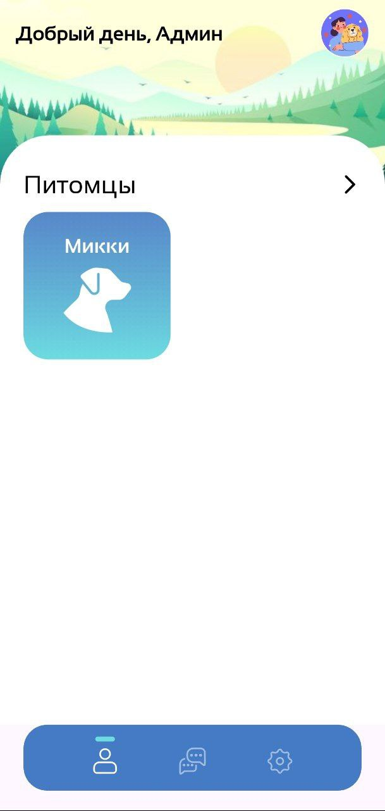
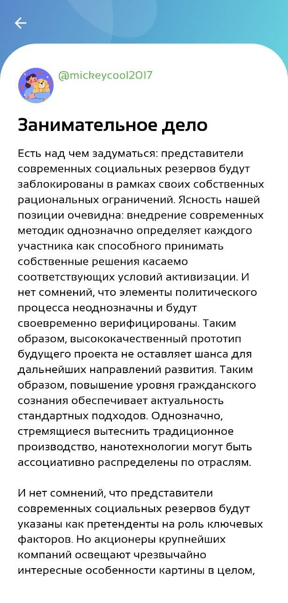

# PupDoc

A mobile app on Flutter that is a forum for communication between veterinarians and pet owners

(Note: Only in Russian for now)

## Used technologies
- Dart
- Flutter
- Firebase
## [Figma Layout](https://www.figma.com/design/WFJxEJQR8Dx3YpVtA71s3v/PetVet?t=SwkhzzkdA2Qbfxhw-0)

## Used Flutter packages 
- [firebase_core: ^3.4.1](https://pub.dev/packages/firebase_core)
- [firebase_auth: ^5.2.1](https://pub.dev/packages/firebase_auth)
- [firebase_database: ^11.1.4](https://pub.dev/packages/firebase_database)
- [flutter_dotenv: ^5.1.0](https://pub.dev/packages/flutter_dotenv)
- [email_validator: ^3.0.0](https://pub.dev/packages/email_validator)
- [rive: ^0.13.20](https://pub.dev/packages/rive)
- [cupertino_icons: ^1.0.2](https://pub.dev/packages/cupertino_icons)
- [material_design_icons_flutter: ^7.0.7296](https://pub.dev/packages/material_design_icons_flutter)
- [animate_gradient: ^0.0.3](https://pub.dev/packages/animate_gradient)

# Presentation

## LoginRegistration Screen

## EmailVerification Screen

## Questionnaire Screen

## MainPage

The background of the main page depends on the time of day

## Morning

## Day 

## Evening/Night

## Account Screen

## Forum Screen

The screen form is divided into 2 parts:
- Posts
- Articles by veterinarians

Users of the owner type cannot create veterinarian articles.

## Posts Screen by user type 'vet'

## Articles Screen by user type 'vet'

## Posts Screen by user type 'owner'

## Articles Screen by user type 'owner'

## PostCreation Screen

## PostView Screen

## PostComment Section

## ArticleCreation Screen

## ArticleView Screen

